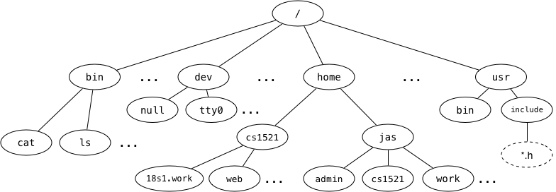

# FILES

## File Systems

Directories/Folders and Files



```
a) full pathname of the web directory -> /home/cs1521/web
b) ~jas/../.. 
~jas - /home/jas
~jas/../.. -> root or /
c) link to parent directory -> ..
d) cat -> file
e) home -> directory
f) tty0 -> character special file, special files allowing the OS to communicate with input/output devices
dev -> devices
extra: /dev/null - a blackhole where you can send garbage output that you don't want to store
```

### Useful Commands
- cd .. moves the directory back by one directory, i.e., go to the parent directory
  - link to parent directory is stored as ..
- cd ~ to get to the root home directory (do `echo $HOME` to show where this is)
  - extra: in bash, there is this thing called tilde expansion if you're interested (~X)

### Symbolic Links
A special kind of file that simply contains the name of another file. They allow arbitrary links between filesystem objects.

They can link up to objects higher in the tree structure, creating graphs.


## Files in C
FILE * - file pointer is a typedef'd structure used by the standard io library to hold the appropriate data for use of fopen, and its family of functions.

Main items it contains:
- the file contents
- the position up to in the file

- typedef: a keyword used to provide existing data types with a new name
> e.g. \
> typedef struct students { \
> &nbsp; &nbsp; char name[50]; \
> &nbsp; &nbsp; char branch[50]; \
> &nbsp; &nbsp; int ID_no; \
> } stu;

### File functions
Most need "#include <stdio.h>".

- FILE *fopen(path, mode)
  - modes:
    - "r" - read
    - "w" - write / creating a new file and writing to it
    - "a" - append / add chars to the end of the file
    - "r+", "w+", "a+"
  - e.g. fopen("/bin/cat", "r")
  - special error cases
    - NULL is returned and errno is set to indicate the error
    - Reasons:
      - If the file you tried to open for reading does not exist.
      - If you try to open a file you do not have permission to access.
      - If the "mode" string was invalid.
      - If the system is out of memory.
      - If you try to create a file and your quota of disk blocks or inodes has been exhausted.
      - If the pathname was too long.
      - Etc...

FILE *file = fopen("test.txt", "r"); \
if (file == NULL) // if there is an error, do some error handling

- fclose (closes a file)
- fseek (move to a different position in our file)
- fprintf - more general version of printf
- fgetc - get a character/byte and move our position by one
- fgets - gets a line from a file pointer

## Streams
- stdin
- stdout
- they are FILE * objects

### Stream and File Functions
- fprintf -> printf
- fgetc -> getc
- fputc -> putc


## Syscalls
- make direct requests to our operating system
- like MIPS syscalls

li $v0, 1 \
li $a0, 2 \
syscall

C is similar: like parsing in $v0 and $a0 as function arguments \
syscall(... 1, ... 2)

### Syscall wrapper functions and their FILE object counterparts

int open(path, flags/modes) - system call wrapper func
FILE *fopen(path, modes) - return FILE *

how do you get the file descriptor fd? can you pass in any int?
- open("test.txt", "r") -> int fd - index to an entry, don't need to know too much but passing around fd can be used for other file functions that use an integer (i.e. lseek)
- find out more here: https://www.man7.org/linux/man-pages/man2/open.2.html

Q13. For each of the following calls to the fopen() library function, give an open() system call that has equivalent semantics relative to the state of the file.

1. fopen(FilePath, "r")
- open(FilePath, O_RDONLY)

4. fopen(FilePath, "r+")
- open(FilePath, O_RDONLY | O_WRONLY)


- fseek vs lseek - FILE *file version instead of int fd
off_t lseek(int fd, off_t offset, int whence); \
options for whence:
  - SEEK_SET - go to offset number of bytes from the start
  - SEEK_CUR - go to offset number of bytes from your current position
  - SEEK_END - go to offset number of bytes from the end of your file

1.  
    1.  lseek(fd, 0, SEEK_END) - offset 10,000 (there's nothing to read here because we're at the end of the file)
    2.  lseek(fd, -1000, SEEK_CUR) - offset 10,000 - 1,000 = 9,000
    3.  lseek(fd, 0, SEEK_SET) - offset 0
    4.  lseek(fd, -100, SEEK_SET) - position is not changed, but returns -1 as the resulting file position would be negative
    5.  lseek(fd, 1000, SEEK_SET) - offset 1000
    6.  lseek(fd, 1000, SEEK_CUR) - offset 2000
    